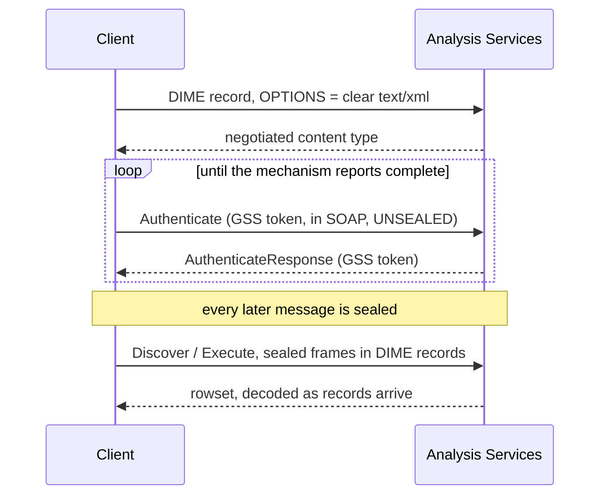

The layers, strictly bottom-up — no lower layer includes a higher one:

```
   catalog / functions      DuckDB surface: ATTACH, table functions, scans
        |
      client                session lifecycle, request/response, error categories
        |                   RowCursor: rows decoded as records arrive
       auth                 GSS handshake carried inside SOAP
        |
     transport              socket lifecycle, timeouts, message reassembly
        |
       dime                 DIME record framing and content-type negotiation
        |
      socket
```

`sealing`, `envelopes`, `rowset`, `redact` and `errors` are leaves used across
layers.

**Sealing is deliberately not in that stack.** The handshake is sent *unsealed*,
and sealing is applied by the client to every message after it, on the way into
the transport. Drawing it between `auth` and `transport` would read as though the
handshake passed through it, which it does not.

The protocol library carries **no DuckDB include and links no security
library**. That is not tidiness: it is what makes the test suite runnable on a
machine that has never contacted an Analysis Services instance, and it is
enforced by the linker rather than by review. When the client briefly called into
the GSS binding directly, the link failed — which is the property working.

## One request, end to end



The handshake is sent **unsealed** — sealing begins only once the context is
established, which is why it is not a layer in the stack above.

## The three pages under here

- [Framing](./framing.md) — DIME records, and why a naive reader desyncs.
- [Sealing](./sealing.md) — the post-authentication frame, which is not in the
  specification.
- [Authentication](./authentication.md) — the GSS handshake inside SOAP, and the
  two seal providers.

## How messages get split

Three independent splits can apply to one message, each handled at a different
layer, and they compose. Getting this wrong corrupts large rowsets specifically —
the case least likely to be exercised by a first test.

1. **Sealed-frame chunking** — a payload longer than the chunk size becomes
   several frames, each with its own header, ciphertext and token.
2. **DIME record chunking** — a message too large for one record is split across
   several, `CF` set on all but the last, `MB` on the first, `ME` on the last.
3. **TCP fragmentation** — reads driven by declared lengths, buffer held across
   calls.

The test suite composes all three at once — a 400-row document cut into ~500
sealed frames inside ~130 DIME records over ~1300 reads — rather than relying on
a response that happens to trigger two of them.

## Testability: the byte seam

`Channel` is an interface with `send`/`recv`/`close`. The real implementation
wraps a socket; tests supply recorded bytes. Everything above the socket is
therefore ordinary unit-testable code, and the suite runs with no server, no stub
to keep in sync, and no security library.

Handshake fixtures are **synthesized, never captured**. A real GSS/SPNEGO token
carries the principal, the realm, the target service and often the machine name;
a committed capture would be a disclosure that merely looks like an opaque blob,
and no scrubber can reliably redact arbitrary token structure.
